# praktikum-javascript

Javascript adalah bahasa script yang diletakkan pada kode HTML dan 
diproses pada sisi klien. Dengan adanya bahasa ini, kemampuan dokumen 
HTML menjadi semakin luas. Sebagai contoh, dengan menggunakan 
JavaScript dimungkinkan untuk memvalidasi masukan - masukan pada 
formulir sebelum formulir dikirimkan ke server.
Javascript bukanlah bahasa Java dan merupakan dua bahasa yang berbeda. 
Javascript diinterpretasikan oleh klien (codenya bisa dilihat pada sisi klien), 
sedangkan kode Java dikompilasi oleh pemrogram dan hasil kompilasi yang 
dijalankan oleh clien.

<h2>Latihan 1</h2>
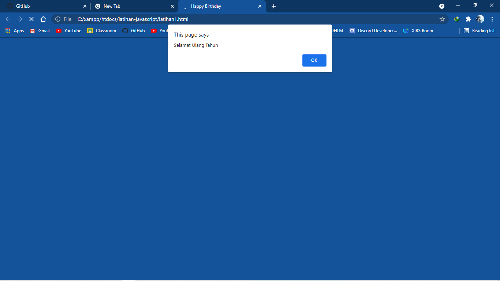 
<h2>Latihan 2</h2>
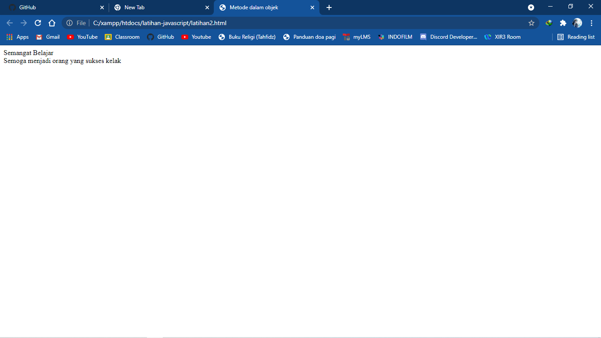 
<h2>Latihan 3</h2>
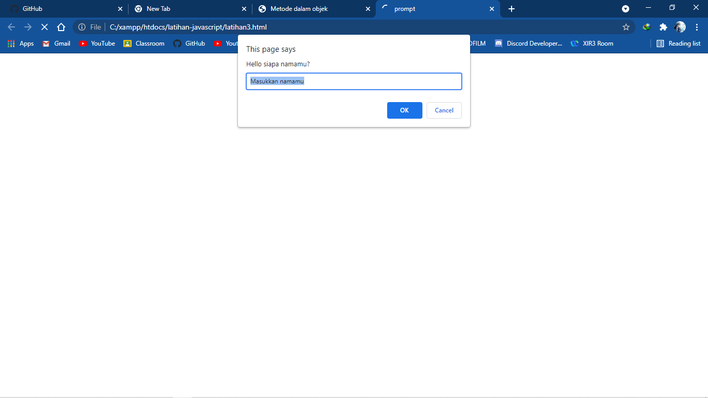 
<h2>Latihan 4</h2>
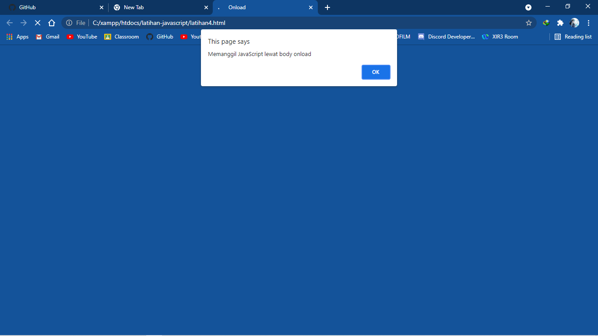 
<h2>Aritmatika</h2>
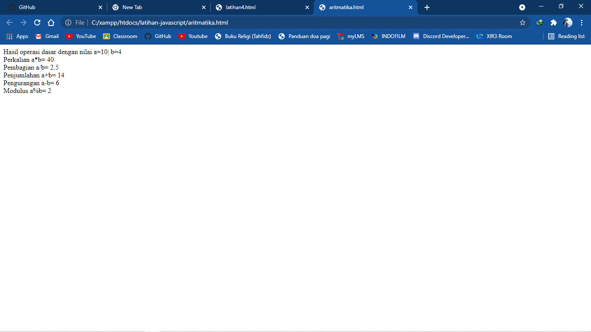 
<h2>Relasional</h2>
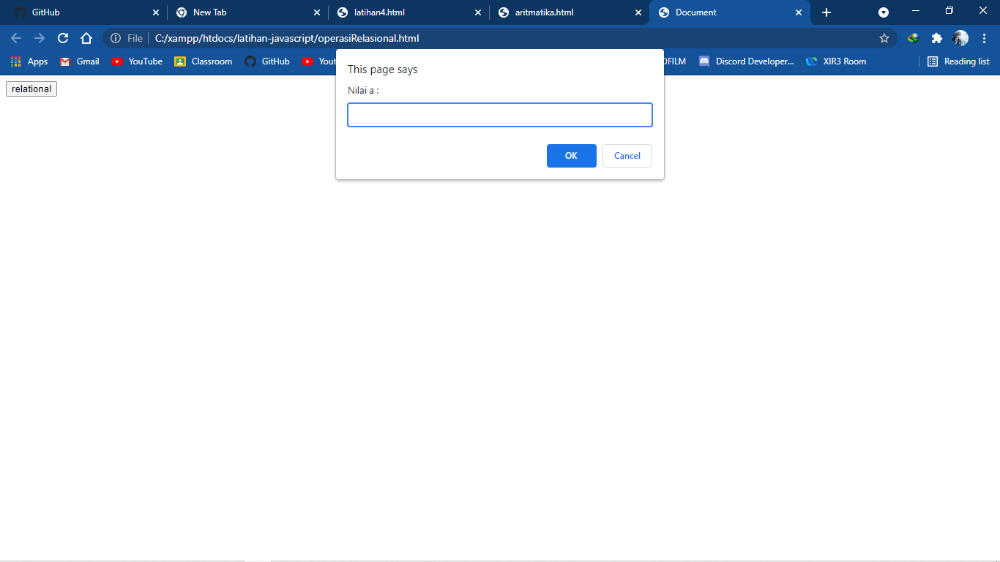 
<h2>For</h2>
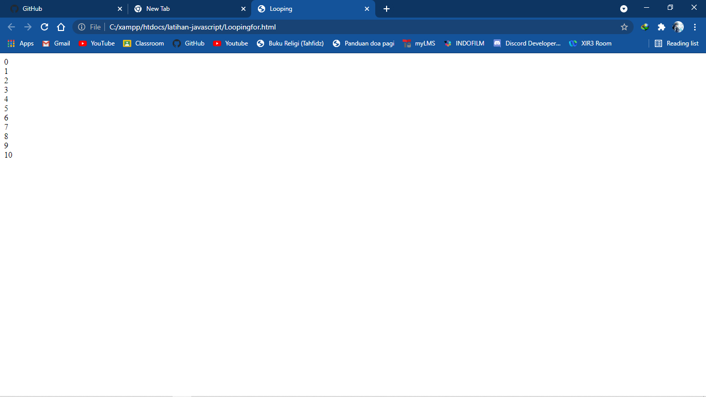 
<h2>Do While</h2>
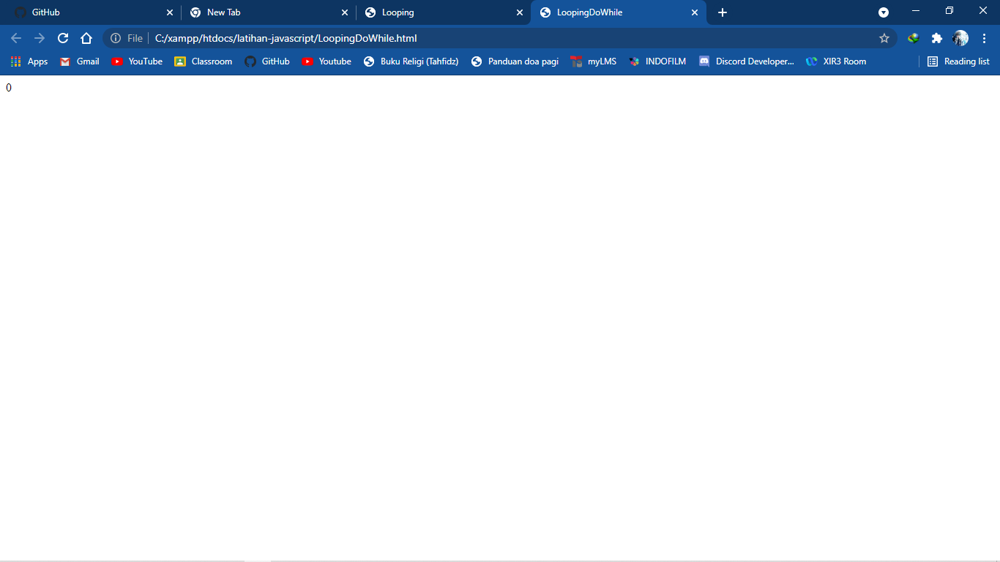 
<h2>Form</h2>
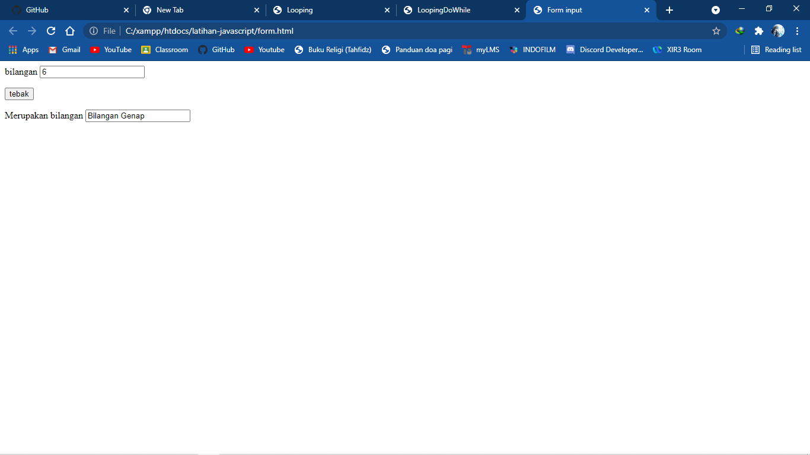 
<h2>Form Button</h2>
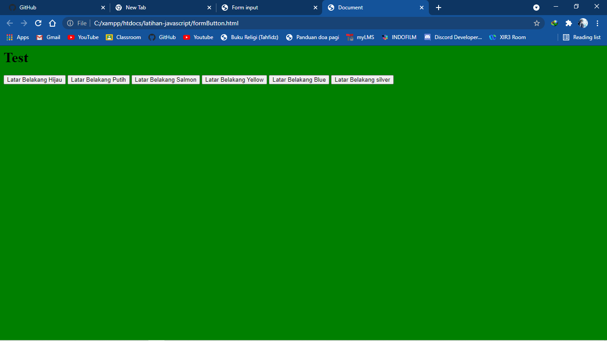 
<h2>Praktikum 1</h2>
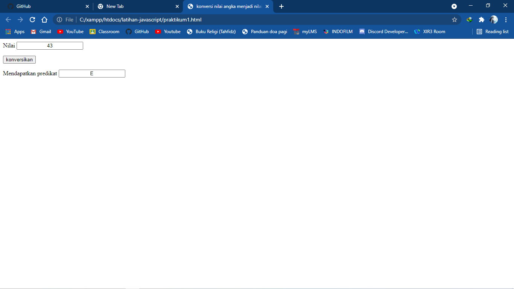 
<h2>Praktikum 2</h2>
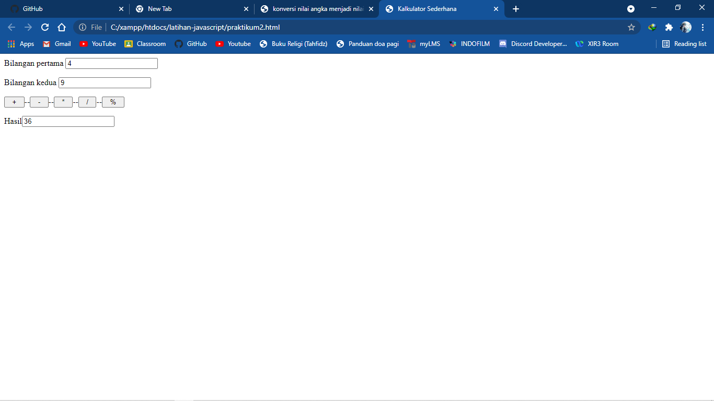 
